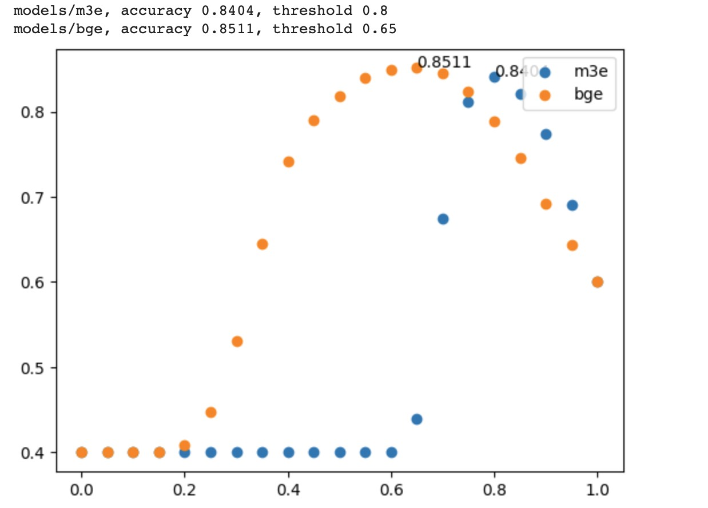

# Semantic Match
这里对不同的语义模型进行测评，语义模型可以用于sentence to sentence，sentence to passage这两个任务，当然通过变化也可以作为分类任务。

## 数据集
这里在线上找了一个s2s的数据集, 因为只是作为评估，所以只下载了1w条训练数据，三元组【sentence1, sentence2, isSimilar】
```json
{"sentence1": "找一部小时候的动画片", "sentence2": "求一部小时候的动画片。谢了", "label": "1"}
```
https://github.com/CLUEbenchmark/SimCLUE


## 评测
这里只是用了两个模型，BGE和M3E，这两个都是今年发布的，是现在中文语义模型的顶流，其中BGE的势头要更足些。


当前的测试集大小只有一万条，从整体上BGE模型的分数要高一些，但是如果需要更加精确的评测则需要增加不同种类的数据集，才能看出泛化能力以及多任务能力。

读者可以做一些类似，s2p任务相关的测评，这里我做的是分类，检索的话需要修改一下metrics函数。有时间的话我后期找一个数据集做一下。